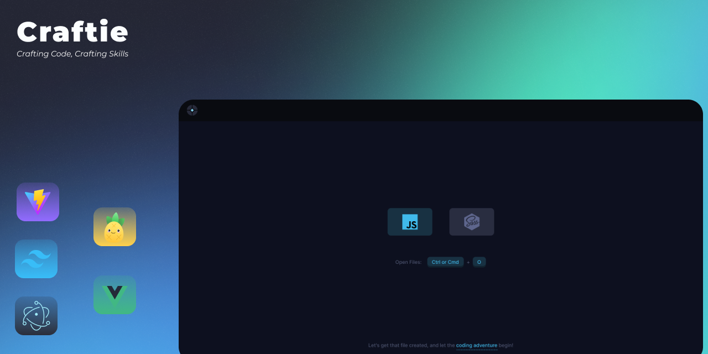

# Heads-up!
Craftie is currently in beta mode, with some basic features already implemented. I am still working on adding more features. Also, please note that craftie has only been tested on Windows 11, but it should also run on Linux and macOS since it is an electron app.


Currently not supported:
- import/export in javascript
- .sass

&nbsp;


Craftie is a playground for learning and experimenting with JavaScript and SASS. It's specifically designed to help you craft your algorithms and practice learning algorithms in JavaScript. Whether you're a newbie coder just learning the ropes or a seasoned programmer looking to test out an algorithm or a data structure, Craftie is the perfect space for you!

Powered by:
- [Electron](https://www.electronjs.org/)
- [Vue.js](https://vuejs.org/)
- [TailwindCSS](https://tailwindcss.com/)
- [Pinia](https://pinia.vuejs.org/)

Special thanks to:
- [UntitledUI Icons](https://www.figma.com/file/ns9u5Z0thmja2C0mcXHKjn/%E2%9D%96-Untitled-UI-Icons-%E2%80%93-1%2C100%2B-essential-Figma-icons-(Community)?type=design&node-id=181-128951&mode=design)
- [IconaMoon](https://www.figma.com/file/bfFPEvp6u885mpBdb3DruO/IconaMoon-1.1-%7C-%2B2400-Icons%2C-8-Styles-(Community)?type=design&node-id=168-2087&mode=design)

# How to Get Started?

Getting started with Craftie is easy! Simply clone this repository and follow the instructions in the README file. You'll be crafting code in no time!

We're excited for you to join us in the Craftie playground. Happy coding!


### Install

```bash
$ npm install
```

### Development

```bash
$ npm run dev
```

### Build

```bash
# For windows
$ npm run build:win

# For macOS
$ npm run build:mac

# For Linux
$ npm run build:linux
```
